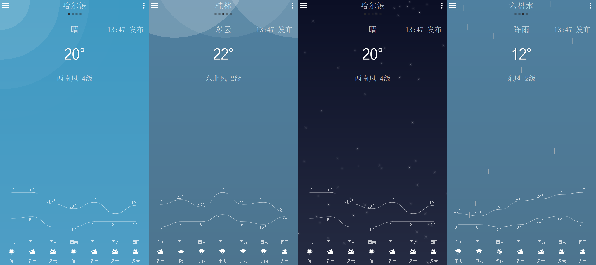
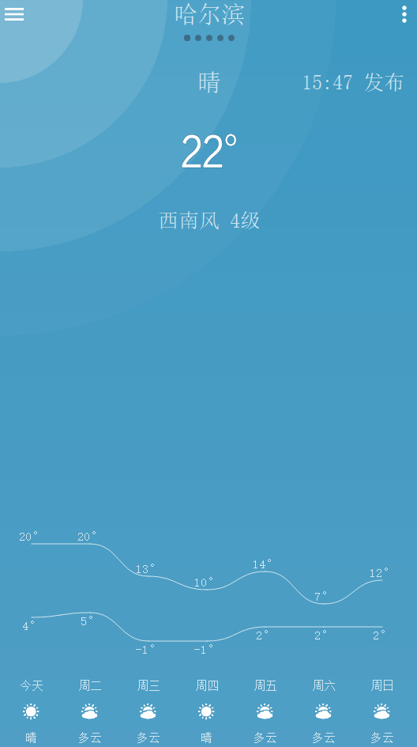

# Weather

Weather 是使用 C++ & Qt Quick 开发的一款天气 App，理论上可以在 Windows、Mac OS、Linux、Android、iOS 等平台上运行。

暂时只提供 Windows 64 位程序下载，如果想运行在其他平台请自行编译。

**本项目中使用图片和动画创意来源于网络，仅供学习参考。**

​    

## Features 特性

- 动态天气背景（区分白天和夜间，使用 Qt ParticleSystem 实现）
- 支持下拉刷新
- 支持主题颜色切换
- 一周天气曲线图
- 县级、区级天气
- 支持 Android DPI 适配
- ~~支持 Android Drawable~~ 

​    

## Screenshot 效果图

​    

## GIF (size:3M)

​    

## 天气预报 API

使用 [和风天气 API](http://www.heweather.com/)  **S6版本**开发，因为免费版每天有一定的请求限制，请替换成自己的 key。

替换方法：将 `Global.qml` 文件中的 `YOU_HEWEATHER_APPKEY` 修改为你自己的和风天气 AppKey。

​    

## 构建需求

- Qt 5.9 及以上
- VC++ 编译器（Windows 平台）
- GCC 编译器（Linux、Android 平台）
- Xcode （Mac OS、iOS 平台）

